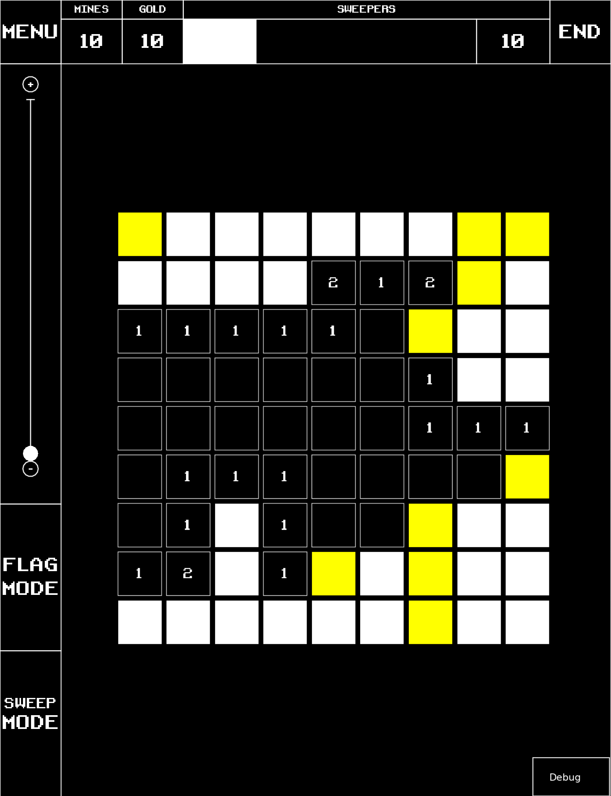

## MINESWEEPER GOLD

Pour mon projet final de ma formation CS50, j’ai décidé de recréer le jeu vidéo classique Minesweeper avec le moteur Löve2D en utilisant le langage de programmation Lua.

Dans cette version, l'objectif est le même: révélez toutes les tuiles sans tomber sur des mines à l'aide des indices. Cependant, dans le mode de jeu "Gold" vous trouverez égelement des tuiles dorées qui ne peuvent seulement être révélées avec des démineurs (sweepers), que vous obtiendrez au fur et à mesure de jouer. vous pouvez également révélé les tuiles normales avec les démineurs mais attention, ceux-ci sont en quantité limité!

Vous pouvez jouer avec des paramètres prédeterminés ou personnaliser vous-même les grilles!

Pour y jouer, vous devez tout d'abord télécharger le moteur LÖVE2D disponible ci-dessous:

https://love2d.org/#download

Vous pouvez maintenant télécharger et lancer le fichier du jeu "Minesweeper Gold.love".

